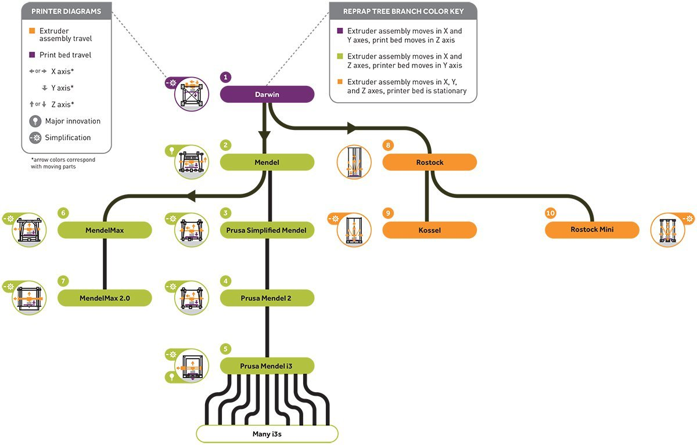

## Results
In this section we expose some prominent characteristics of the peer to peer interactions using the Activity Theory framework. We study at a very general level how peer to peer relations and interactions are reflected on the artifacts, object, subject, community, rules and division of labor components of the Activity System model.

[//]:# (Open peer to peer collaborative work (No control on peers but only on the process)

#### Essential peer to peer artifacts found in the open source projects studied
From an Activity Theory stand point we can identify many artifacts within open source projects based on the different processes that take place. Mapping out all these artifacts is beyond the scope of this work. Nevertheless there are specific artifacts that are essential to enable an open and horizontal peer to peer collaborative process, or what we have been calling peer production artifacts:
- **Foundational artifacts**. These kind of artifacts describe in broader terms the main rules of the game for open source projects. Among these artifacts we can find perhaps the most important which is the **license** under which the content(source) is released (open) to the public.**Licenses** describe in legal terms what can and cannot be done with the source code ranging from ethical issues to commercial and distribution issues. They also often describe how to give credit to authors, and properly
release new improvements, but also distribute the content and more. It is interesting to notice that since the FREE Software licenses were created, every open source project has adopted or created similar licenses to distribute and share code, but also visual images as well as CAD files. There are other artifacts the specify how to contribute to the project often called *contributing guidelines*, but also the code of conduct, and instructions on how to participate.
- **Peer content production artifacts** There are variations in the way content creation takes place, but ultimately it requires of a web service, where other peers can access and modify the content created collaboratively. These ranges from dedicated git based services like github, or gitlab (Arduino, ), but also wikis.
- **Peer review artifacts** Like peer content production, peer review relates to a more operational level within the activity system. In the case of software, version control of the code is essential. This can be implemented also in different ways, but the standard and widely used system for version control at the moment in the software industry is git, for several reasons that go beyond our scope. Other tools for peer review such as from mailing lists, forums, and chats were found in both software and hardware cases.

### The main object-subject relation in free peer production processes
[//]:# (user led innovation and improvement)
[//]:# (intensive user participation in problem solving)
Linus Torvalds, the creator of the Linux kernel, on an interview reveals:
> Every single project I haved worked on was for something I needed.

**We have found in our study that all the open source projects have been developed by lead users that have had some level of dissatisfaction with previous solutions** Lead users according to...

All these projects have started because at a certain point users with particular needs and problems, haven't found or have access to the solution they have been looking for to their problems. Moreover these *lead users* have had the capacities to build a new product, and enabled eventually that other users participate in developing, and improving the open source product in new directions.  

For instance Linus Torvalds developed the Linux Kernel partly because he needed, partly because he enjoyed programming, he says that he never imagined Linux would evolve into what it is today. Richard Stallman the father of the FREE/Software movement and the GNU/Linux Project, refused to accept that computer scientists, programmers and users in general were not able to do study the source code.
Josef Prusa, a main contributor in the RepRap community explains in an interview:
>  originally got into 3D printing because I was into music, and I started to build my own MIDI controllers. I needed all sorts of little knobs and faders. So that’s how I found 3D printing. I started to build one myself, but it took so much time and so many parts that I eventually started to make it simpler. I started to improve it and give back, and so that’s how the Prusa Simplified Mendel came to the world.

**Open Source Ecology** was also motivated by the difficulties and circumstances that Marcin Jakubowski experienced after starting a farm:
> I bought a tractor then it broke, I paid to get it repaired, then it broke again....I realized that the truly appropriate, low-cost tools that I needed to start a sustainable farm....just didn't exist.

In the case of Git and Gitlab the original motivation was again to solve problems meeting specific requirements. Git started as a tool for version control on the Linux project. Version control is an essential artifact in the context of software.
>...we were in this bad spot where we had thousands of people
who wanted to participate, but in many ways, I was the kind of break point,where I could not scale to the point where I could work
with thousands of people. So Git is my second big project which was only created for me to maintain my first big project.(Linux)

Similarly Gitlab was started based on a need to collaborate on software development teams by a software developed. In the case of Arduino the main motivation was to create simple and low cost tools for creating digital projects by non-engineers in the an academic context. Before launching the project, the main users teachers and students, had difficulties because of not having a low cost solutions to teach electronics. Before Arduino, it was very expensive for students to work with microcontrollers during their studies.

#### The "expansion" of the object or community's needs and desires

[//]:# (new possibilities and paths within *free peer to peer* communities)

Across the six projects, it was found that the object, in other words, the composition of needs and desires that the community aims to full fill evolve by expansion in different directions. Object expansion by adding new features to the current product (extension) is a type of expansion.

Another type of expansion is diversification, often coming from using or wanting to use the product in a different context.
Moreover adding new requirements to the projects like developing services and commercial distributions of the content, as well as finding a market for open source products has enriched and expanded the object(s) composition.

In many of the projects the object's expansion takes place continuously, as new peer segments join the community. For instance, at the beggining of some projects (like Arduino and the Linux kernel),  the open source aspect was not the main driver to make the first improvement. Linus Torvalds shared on an interview his first motivations, not being aware of the open source possibility:
> I did not started Linux as a collaborative project, I started it as one in a series of many projects I had done at the time for myself, partly because I needed the end result, but even more because I just
enjoyed programming...and there was no open source, really, on my radar at all.

In both of this cases, the open source or *the free peer production aspect* of the project developed as a natural response to scale up the project and scale it.

[//]:# (The Linux kernel is a contribution from a former outside member of the community (Torvalds), who finally released the kernel under the General Public License, and became the Kernel of the GNU/Linux Operating system.Arduino also evolved from a set of systems, (*processing* and *wiring*) to a fully integrated system. Also the target group for this solutions was one university and it evolved as a larger project, where the open source aspect was seriously considered as a strategic decision.
It was also found that the Git control version system is being adopted by non-software version control.)

For instance, within the Gitlab community, user experience designers expressed the need of extending git for image based version control (for two dimensional and threedimensional representation of content), the same was the case in the Open Source Ecology community. OSE developers have been discussing and proposing several times to use git as a core tool for their development process. This gives evidence of a tendency to expand the object (in this case git).

Expansion takes also place as variations of the open source products by members within the community, but also external peer entities, often called third party developments.
In the case of ReRap, and Arduino it was found at least more than 10 variations, either as new products with specific features, or as new versions of a product.

Examples of object expansion:
> Teensy by PJRC – Paul has contributed a lot of code, bug reports, pull requests and to the discourse in general.
Flora by Adafruit – Limor has contributed over 100 libraries and countless tutorials about Arduino becoming one of the most important members of the Arduino ecosystem.

#### The "expansion" of the subject in peer to peer Activity Systems
**Community composition the pyramid of users**
- [ ] Here I talk about community of users, user groups examples...

> It didnt even started with people contributing with code, but people contributing with ideas.

**Division of labor** users producers are kings, users are allowed to play different roles, they can participate and there are no limits to how much they can contribute or which roles to play...(Entrepeneurs,)

Concrete persons can play different roles,

Furthermore they have become contributors, developers and entrepeneurs within their communities, becoming expert developers, profesionals and community leaders.

#### The unexpectedness of the positive outcomes vs expected negative outcomes
[//]:# (It is actually the inverse narrative, I started looking at the outcomes, of the activity system, and from there on reached to the results above)
**Consistent evolution of versions and variants:**
Each of the open source projects document the different version releases which represent new iterations and developments on the open source product. Releases are announced very often before the actual release discussing the main improvements that will take place. It was found that some projects like Linux, Arduino, ReRap and Open Source Ecology products are also distributed by other peer entities with different purposes and objectives. Many of these distributions are variants with their own versions (improvements) over time.

On the other hand it has been found that git and Gitlab are do not have at the moment variant releases and distributions, but instead version releases.

In the case of Linux, for instance there are literally hundreds of distributions (variants), which reflects a variety of releases, contributions, and motivations within the community. Examples of popular Linux distributions include Android, the most widely used operating system for mobile phones(%), Ubuntu for desktop and server operating system(#users, #market share), Debian([]) In the case of Arduino, there at least 15 official boards distributed by Arduino company, each of them with diversity of features and sizes. RepRap also shows the same pattern of evolution like Linux, Arduino,

Besides these there are third party distributions including "clones", "derivatives and counterfeits".
In open hardware "clones" refer to distributors that basically replicate the product based on the open source available, and benefit without clear contribution to the community

## The "Bootstrapping" dynamics in open peer to peer collaboration

#### Community composition:
In all the projects except Open Source Ecology, there has been a sustained increase of participants and users adopting the open source products released. For instance Linux started as part of a very small group of hackers and computer scientists in 1992,....

Successful initiatives have provided many degrees of freedoms with regard to how to use and ....., distribute and , and participants, it allows others to reuse
